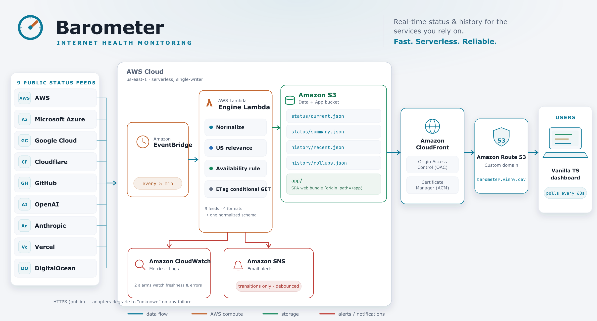
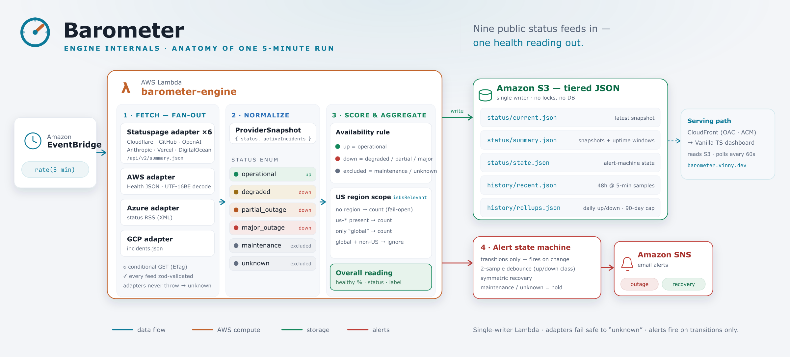

# Barometer

> A weather station for the internet. Barometer reads the public status of major cloud, network, and AI
> providers every 5 minutes, normalizes their wildly different formats into one schema, and serves a clean
> static dashboard that answers a single question at a glance: **is the internet healthy right now?**

A single scheduled AWS Lambda is the only writer to a private S3 bucket; CloudFront (Origin Access Control)
serves a vanilla-TypeScript dashboard that polls static JSON. No servers, no API Gateway, no database — it
runs for a few dollars a month.

```
EventBridge Scheduler (every 5 min)
        │
        ▼
   Lambda (engine, Node 24)        fetch all providers concurrently → normalize → detect
        │                          transitions → debounce → alert → tier history
        ▼
   S3 (private; CloudFront OAC only)
     /status/current.json   latest snapshot            (cache 60s)
     /status/summary.json   headline + uptime windows  (cache 60s)  ← the dashboard polls this
     /status/state.json     alert state machine        (internal)
     /history/recent.json   last 48h @ 5-min           (cache 60s)  ← sparklines
     /history/rollups.json  daily uptime, last 90d      (cache 60s)
     /app/…                 built frontend, hashed     (immutable)
        │
        ▼
   CloudFront (OAC, HTTPS, barometer.vinny.dev) ──► Browser  (polls summary.json every 60s + on refocus)
        ▲
        └── CloudWatch alarms (Lambda errors + missing RunSuccess) ──► SNS email  (watch the watcher)
```

See [`SPEC.md`](./SPEC.md) for the full design and [`docs/superpowers/plans/`](./docs/superpowers/plans/) for the
implementation plan.

## Architecture

The system at a glance — nine public status feeds in, one health reading out:

<picture>
  <source media="(prefers-color-scheme: dark)" srcset="design/barometer-overview-almanac-dark.png">
  
</picture>

Inside the engine — what one 5-minute run actually does (fetch fan-out → normalize → score → write + alert):

<picture>
  <source media="(prefers-color-scheme: dark)" srcset="design/barometer-engine-almanac-dark.png">
  
</picture>

> Diagrams use the project's [Almanac design system](design/) (`design/tokens.css`) and follow your GitHub light/dark
> theme via `<picture>`. The source SVGs live alongside the PNGs in [`design/`](design/); the `*-dark.svg` files are the
> light SVGs remapped to the dark token set. Edit text and re-render with `rsvg-convert -w 2400 <file>.svg -o <file>.png`.

## Pages

Two pages, both served from the `/app` prefix and sharing one footer (**Home · About**):

- **`/` — the dashboard.** The live product: the overall reading, per-provider cards, sparklines, and
  uptime windows, polling `summary.json` every 60s.
- **`/about.html` — the live About page.** What Barometer is and how it works, and doubles as the project
  overview: a live reading-band hero, the provider set, the availability rule shown as status chips, the
  pipeline, the architecture diagram, and the source.

`/landing.html` is a meta-refresh redirect to `/about.html` — a stub kept so any stale link still resolves.
(A standalone marketing "Overview" page was merged into About; see the design note in [`CLAUDE.md`](./CLAUDE.md).)

## Providers (9)

AWS · Microsoft Azure · Google Cloud · Cloudflare · GitHub · OpenAI · Anthropic · Vercel · DigitalOcean.

Six run on Atlassian Statuspage and share one parametrized adapter; AWS, Azure, and GCP have bespoke adapters
(AWS Health JSON — UTF‑16BE; Azure RSS; GCP incidents JSON). The list is a one-line change in
`packages/engine/src/config/providers.ts`. (The original brief listed Fastly and GitLab; Fastly bot-blocks
automated polling and GitLab runs on Status.io rather than Statuspage, so they were swapped for Vercel and
DigitalOcean. Anthropic's status now lives at `status.claude.com`.)

## Availability rule

Uptime math, alerting, and the overall reading all use one classification:

| Status | Counts as |
|---|---|
| `operational` | **up** |
| `degraded`, `partial_outage`, `major_outage` | **down** |
| `maintenance`, `unknown` | **excluded** from the denominator |

Uptime % = `up / (up + down)`; planned maintenance and our own fetch failures never punish a provider's score
(empty window → `—`, never a false 100%). The overall reading is the worst-case across non-excluded providers.
The knob lives in `packages/types/src/availability.ts`.

## Repository

```
packages/types/    shared zod schemas + inferred types + the availability rule
packages/engine/    Lambda: http client, adapters, normalizer, history, alerting, store, handler
packages/web/       Vite multi-page site: the dashboard (/) + the live About page (tokens, headline, cards, sparklines)
infra/              Terraform modules (storage, cdn, engine, schedule, alerting, monitoring) + root
```

## Local development

Requires [Bun](https://bun.sh).

```bash
bun install
bun run test        # all packages, no network access
bun run typecheck   # strict TS across types/engine/web
bun run dryrun      # fetch all providers live + print summary.json (no S3 writes, no alerts)
bun run --filter '@barometer/web' dev   # local dashboard against demo data in packages/web/public
```

`bun run dryrun` is the fastest way to see the engine end-to-end; it runs the full fetch + normalize against
the real provider APIs and prints `summary.json` to stdout.

## Configuration

All tunables are Terraform variables (see [`infra/variables.tf`](./infra/variables.tf) and
[`infra/example.tfvars`](./infra/example.tfvars)):

| Variable | Default | Purpose |
|---|---|---|
| `domain_name` | `barometer.vinny.dev` | Custom CloudFront domain (ACM cert auto-requested in us‑east‑1) |
| `route53_zone_id` | _(required)_ | Hosted zone for the domain + cert validation |
| `alert_email` | _(required)_ | SNS subscription for outage/recovery alerts |
| `check_interval_minutes` | `5` | EventBridge Scheduler rate |
| `retention_recent_hours` | `48` | High-resolution sample window |
| `retention_rollup_days` | `90` | Daily uptime rollup window |
| `providers_json` | `""` | Optional JSON override of the provider list (else the compiled-in 9) |
| `bucket_name` | `barometer-data` | S3 bucket (names are globally unique — change this) |
| `name_prefix` | `barometer` | Prefix for resource names |

## Deploy

**Prerequisites:** Terraform ≥ 1.5, the AWS CLI authenticated to the target account, [Bun](https://bun.sh)
(for the web + Lambda build), and a Route 53 hosted zone for `domain_name` (the ACM certificate and the
alias records depend on it).

```bash
cp infra/example.tfvars infra/terraform.tfvars   # then edit route53_zone_id, alert_email, bucket_name
terraform -chdir=infra init
scripts/deploy.sh -var-file=terraform.tfvars      # builds web + lambda, applies, uploads the frontend
```

After the first apply, **confirm the SNS subscription email** AWS sends to `alert_email`, then seed the data
files (so the dashboard isn't empty until the next 5-minute tick):

```bash
scripts/seed.sh    # invokes the Lambda once
```

`scripts/deploy.sh` builds the web bundle and the Lambda zip, runs `terraform apply`, and syncs
`packages/web/dist` to the `/app` prefix with the right cache headers (hashed assets immutable; the HTML
entries — `index.html`, `about.html`, and the `landing.html` redirect — re-uploaded `no-cache` and
invalidated so deploys are picked up immediately). The engine's status/history JSON is written by the
Lambda, never by the deploy.

For infra-only changes (e.g. a provider upgrade or a Lambda runtime bump), `scripts/plan-apply.sh
-var-file=terraform.tfvars` is a review-gated alternative: it builds the Lambda bundle, runs `terraform init`,
shows the plan, and applies only the saved plan after you confirm — without re-uploading the frontend.

## Teardown

```bash
aws s3 rm "s3://$(terraform -chdir=infra output -raw bucket_id)" --recursive   # empty the bucket first
terraform -chdir=infra destroy -var-file=terraform.tfvars
```

## Observability & cost

The Lambda emits structured JSON logs (per-provider outcome, run duration) and custom CloudWatch metrics under
the `Barometer` namespace (`RunSuccess`, `RunDurationMs`, per-provider `FetchSuccess`, status counts). Two
alarms watch the watcher — Lambda `Errors` and a missing `RunSuccess` heartbeat — and notify the SNS topic, so
a broken Barometer pages you instead of silently serving stale green.

**Expected cost: a few dollars a month at most.** ~8,600 short Lambda invocations, tens of thousands of small
S3 writes, minimal CloudFront traffic, and SNS within the free tier.

## Alerting

Alerts fire on **state transitions only**, never repeatedly while a provider stays down. A new status must
persist for 2 consecutive checks (debounce) before it triggers; recovery requires 2 consecutive operational
checks. `maintenance` and `unknown` are "hold" states — they never alert and never count as recovery, so
planned work and transient fetch failures generate no noise. Default channel is SNS email; the delivery sits
behind a `Notifier` interface so a Telegram path is a small addition later.

## License

[MIT](./LICENSE) © Vinny Carpenter
